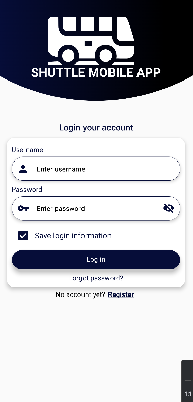
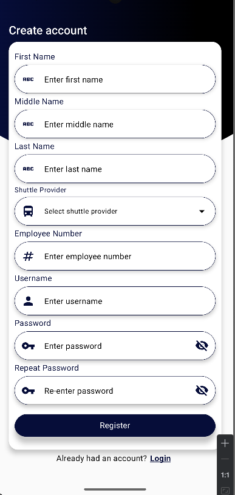
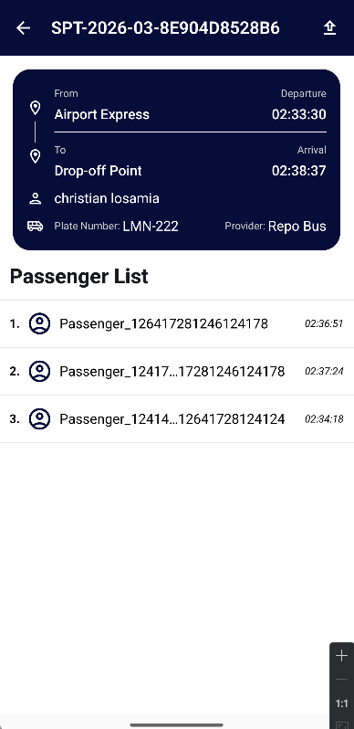
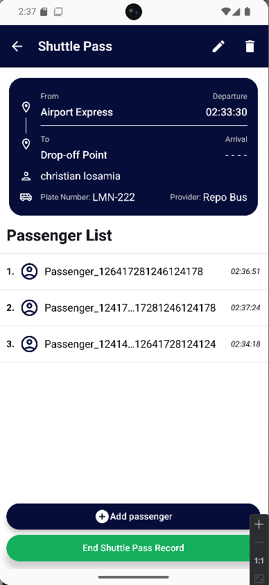
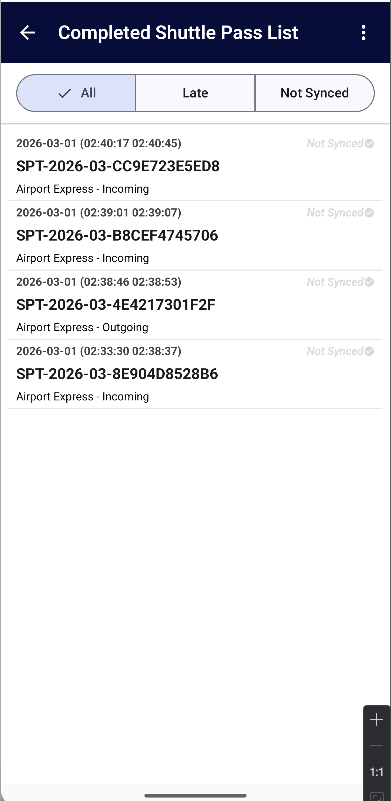

# Shuttle Mobile App  
### Offline-First Android Application Built with Clean Architecture & MVVM

Android application designed to manage shuttle pass records using a scalable and maintainable architecture.

This project demonstrates modern Android development practices including:

- Clean Architecture
- MVVM
- Offline-First Data Strategy
- Room + Retrofit Integration
- Hilt Dependency Injection
- Jetpack Compose (Material 3)

# Project Overview

Shuttle Mobile App is designed to operate reliably in environments with unstable or limited internet connectivity.

The application ensures:

- Data persistence even when offline
- Reliable synchronization once network is restored
- Secure authentication flow
- Clean separation of business logic and UI
- Scalable codebase for long-term maintenance

This project reflects real-world enterprise Android engineering standards.

# Core Features

✅ Offline-first data handling  
✅ Local Room database storage   
✅ Clean DTO ↔ Domain ↔ Entity mapping  
✅ Material 3 UI with Jetpack Compose  
✅ Dependency Injection using Hilt  
✅ Coroutine & Flow-based asynchronous handling  

# Tech Stack

| Category | Technology |
|----------|------------|
| Language | Kotlin |
| UI Toolkit | Jetpack Compose (Material 3) |
| Architecture | Clean Architecture + MVVM |
| Local Storage | Room Database |
| Networking | Retrofit2 + OkHttp |
| Dependency Injection | Hilt |
| Concurrency | Kotlin Coroutines + Flow |
| Serialization | Gson / Moshi |

# UI Screens

